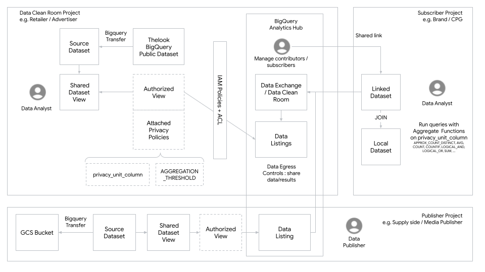

# BigQuery Data Clean Room on Google Cloud deployment with Terraform
This project intends to provide a deployment of a Bigquery Data Clean Room on Google Cloud using Terraform.

Disclaimer : While writing this project, several features of the BigQuery Data Clean Room product are not yet available or still alpha stage. Various workarounds have been used to make this Clean Room deployable. This is not supported code by Google and is provided on an "AS IS" BASIS, WITHOUT WARRANTIES OR CONDITIONS OF ANY KIND.

## Architecture Design

This is a simple diagram of a Data Clean Room on Google Cloud 

## Components
[BigQuery](https://cloud.google.com/bigquery/docs/introduction) is centric to the deployment of [Data Clean Rooms] (https://cloud.google.com/bigquery/docs/data-clean-rooms) on Google Cloud. Yet Data can be imported from a BigQuery DataLake external bucket like S3 or GCS. 

In the current setup we use the DataExchange feature of BigQuery Analytics Hub since Data Clean Rooms are not yet fully available through the API. We implement on the DataExchange the Privacy Policies that enable to provide the same feature as the Data Clean Room does, by enforcing an `aggregation_threshold`.

## Setup

### Prerequisites

### Install dependencies

### Set variables

### Running the script

## Troubleshooting